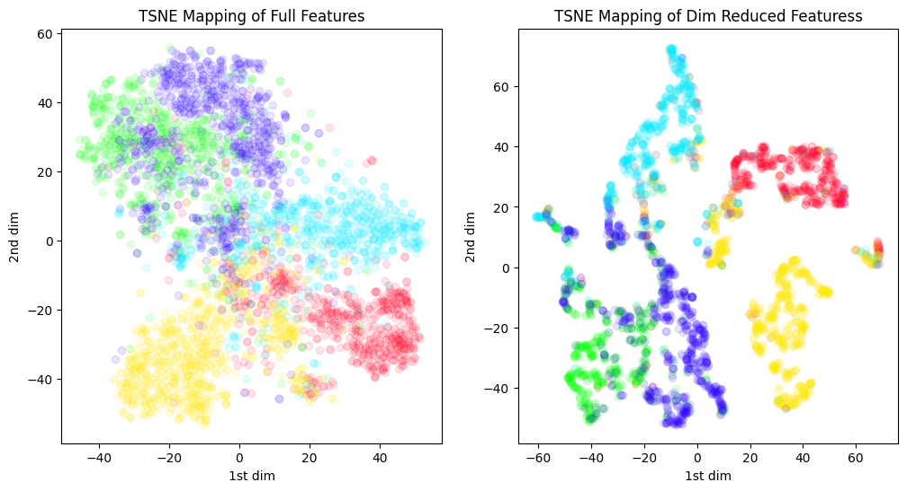

# Data Mining Projects
This repository contains projects written for a data mining class. They are roughly themed as follows:
1. [project_1](project_1) - classifcation
2. [project_2](project_2) - clustering
3. [project_3](project_3) - recommendation systems
4. [project_4](project_4) - regression

Here is an example from project 2, which shows the features of a dataset of 5 flowers extracted using an autoencoder. 
We then perform a compression by reducing the dimensionality from 4096 features to 50 via UMAP. Below is a
projection of the resulting clusters:

# Installation
1. Install Python 3.9 or higher.
2. Install all dependencies with `pip install -r requirements.txt`.
3. For any project, start up a jupyter server and open the `.ipynb` file.

